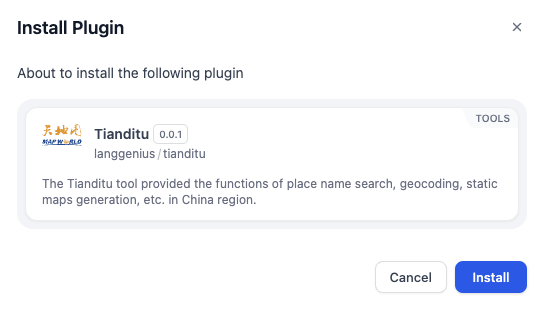

# Overview
The Tianditu plugin provides seamless integration with Tianditu (天地图), China's national map service platform. 

This plugin enables users to access various geospatial tools for location-based services, including address-to-coordinate conversion, point-of-interest (POI) searches, and static map generation.

# Configure
1. Install the Plugin
2. Go to the Aiexec Marketplace.
3. Search for the Tianditu Plugin.
4. Click "Install" to add the plugin to your workspace.

5. Register for a Tianditu API Key
6. Visit [Tianditu Registration Page](https://passport.tianditu.gov.cn/register) and create an account.
7. After registering, log in to [Tianditu API Management](http://lbs.tianditu.gov.cn/home.html).
8. Generate an API Key to use with the plugin.
9. Authorize the Plugin

Before using the tools, you need to authorize the plugin with your Tianditu API Key:
1. In your workflow, add any of the Tianditu tools (e.g., "Get Coords Converted from Address Name").
2. Click on the "To authorize" button in the tool configuration panel.
3. Enter your Tianditu API Key.
4. Save your credentials to complete the authorization process.
5. Configure Input Variables
Each tool requires specific input variables:
## Get Coords Converted from Address Name
- Address Name (Required): The address you want to convert into geographic coordinates.

## Point of Interest Search
- poi keyword (String, Required): The keyword for the type of POI you want to search for (e.g., "restaurant," "hotel," "park").
- base current point (String, Required): The base location for the search in the format `latitude,longitude` (e.g., `39.9,116.4` for Beijing).

## Generate a Static Map
- keyword (String, required)

